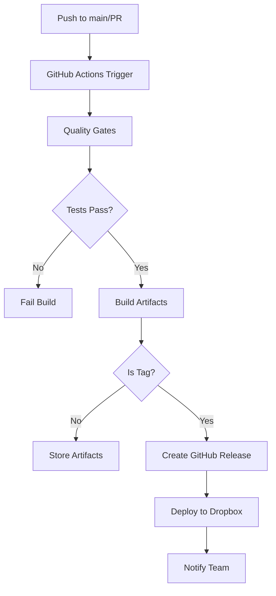

# CI/CD Strategy for Tidy DS Toolbox

## Overview

This document outlines the continuous integration and delivery workflow for the Tidy DS Toolbox Figma plugin, designed for internal distribution via Figma's "Import from manifest" feature.

---

## 1. Architecture & Goals

### Current State

- Manual copying of `manifest.json` + `dist/` folder to Dropbox
- No versioning, changelogs, or quality gates
- Risk of distributing broken builds

### Target State

- Automated builds triggered on every commit/tag
- Semantic versioning with changelog generation
- Quality gates (lint, typecheck, build validation)
- Automated distribution to shared location
- GitHub Releases as source of truth
- Easy rollback capability

---

## 2. CI/CD Pipeline Components



---

## 3. GitHub Actions Workflows

### 3.1 Continuous Integration (`.github/workflows/ci.yml`)

**Triggers:** Every push and pull request

**Jobs:**

1. **Lint & Format Check**
   - Run ESLint
   - Run Prettier check
   - Fail fast on style violations

2. **Type Safety**
   - Run `tsc --noEmit`
   - Validate no TypeScript errors

3. **Build Validation**
   - Run full build process
   - Verify `manifest.json` validity
   - Check bundle size limits
   - Ensure single-file output

4. **Artifact Storage**
   - Upload build artifacts for inspection
   - Retain for 7 days

### 3.2 Release & Deploy (`.github/workflows/release.yml`)

**Triggers:** Git tags matching `v*.*.*` (e.g., `v1.2.3`)

**Jobs:**

1. **All CI checks** (reuse CI workflow)

2. **Version Validation**
   - Verify tag matches `manifest.json` version
   - Ensure changelog entry exists

3. **Build Release Artifacts**
   - Production build
   - Generate checksums
   - Create distribution package

4. **Create GitHub Release**
   - Auto-generate release notes
   - Attach `plugin-bundle.zip` (manifest + dist)
   - Mark as latest release

5. **Deploy to Dropbox**
   - Upload to shared folder via Dropbox API
   - Maintain version history (last 5 releases)
   - Update `latest/` symlink

6. **Notifications**
   - Post to Slack/Teams channel
   - Email key stakeholders
   - Include changelog summary

---

## 4. Versioning Strategy

### Semantic Versioning (SemVer)

Follow `MAJOR.MINOR.PATCH` convention:

- **MAJOR:** Breaking changes, new Shell architecture
- **MINOR:** New modules, feature additions
- **PATCH:** Bug fixes, performance improvements

### Version Synchronization

Maintain version in three places (automated via scripts):

1. `package.json` → `"version": "1.2.3"`
2. `manifest.json` → `"version": "1.2.3"`
3. Git tag → `v1.2.3`

### Automation Script (`scripts/version-bump.sh`)

```bash
#!/bin/bash
# Usage: ./scripts/version-bump.sh patch|minor|major

# Updates package.json, manifest.json, creates commit + tag
npm version $1 --no-git-tag-version
VERSION=$(node -p "require('./package.json').version")
jq --arg version "$VERSION" '.version = $version' manifest.json > tmp.json && mv tmp.json manifest.json
git add package.json manifest.json
git commit -m "chore: release v$VERSION"
git tag "v$VERSION"
```

---

## 5. Changelog Management

### Approach

Use **Conventional Commits** + automated changelog generation

### Commit Message Format

```
<type>(<scope>): <description>

[optional body]

[optional footer]
```

**Types:**

- `feat`: New feature (triggers MINOR bump)
- `fix`: Bug fix (triggers PATCH bump)
- `docs`: Documentation changes
- `refactor`: Code refactoring
- `perf`: Performance improvements
- `test`: Test additions
- `chore`: Build/tooling changes
- `BREAKING CHANGE`: (triggers MAJOR bump)

### Tools

- **standard-version** or **release-please** for automation
- Generates `CHANGELOG.md` from commit history
- Updates versions automatically

---

## 6. Distribution Architecture

### 6.1 Dropbox Structure

```
/Company Shared Folder/
  Figma Plugins/
    Tidy DS Toolbox/
      latest/                    # Symlink to current release
        manifest.json
        dist/
      releases/
        v1.2.3/
          manifest.json
          dist/
          CHANGELOG.md
        v1.2.2/
          ...
      archive/                   # Versions older than 5 releases
```

### 6.2 Dropbox Deployment Options

**Option A: Dropbox API (Recommended)**

- Use GitHub Action with Dropbox API token
- Upload via `rclone` or custom script
- Atomic updates, reliable

**Option B: Dropbox CLI**

- Install Dropbox CLI in runner
- Sync specific folder
- Simpler but less control

**Option C: GitHub Releases Only**

- Users download from GitHub Releases page
- Manual import to Figma
- No automation needed

---

## 7. GitHub Actions Implementation

### Required Secrets

Configure in GitHub repository settings:

1. `DROPBOX_ACCESS_TOKEN` - For API uploads
2. `SLACK_WEBHOOK_URL` - For notifications (optional)
3. `NPM_TOKEN` - If using private npm packages

### Repository Settings

- Enable "Allow GitHub Actions to create and approve pull requests"
- Protect `main` branch: require CI checks before merge
- Require signed commits (recommended)

---

## 8. Quality Gates Checklist

Before any release is deployed:

- ✅ All tests pass
- ✅ No TypeScript errors
- ✅ No linting errors
- ✅ Bundle size within limits (<2MB recommended)
- ✅ Manifest valid JSON with required fields
- ✅ Version matches across all files
- ✅ Changelog entry exists for version

---

## 9. Rollback Procedure

### Quick Rollback

1. Navigate to GitHub Releases
2. Find previous stable version
3. Download `plugin-bundle.zip`
4. Upload to Dropbox `latest/` folder
5. Notify team of temporary rollback

### Automated Rollback

Add GitHub Actions workflow (`.github/workflows/rollback.yml`):

- Triggered manually with version input
- Fetches specified release from GitHub
- Re-deploys to Dropbox `latest/`
- Notifies team

---

## 10. User Communication

### Release Notifications

When new version is deployed:

**Slack/Teams Message Template:**

```
🚀 New Tidy DS Toolbox Release: v1.2.3

📝 Changes:
- Added Color Lab module (experimental)
- Fixed text rendering in Text Master
- Performance improvements

📦 Installation:
Figma will auto-update on next launch, or manually re-import from:
Dropbox > Company Shared > Figma Plugins > Tidy DS Toolbox > latest

📖 Full Changelog: [GitHub Release Link]
```

### Update Instructions Document

Create `HOW_TO_UPDATE.md` in Dropbox folder:

- Step-by-step import guide
- Troubleshooting common issues
- Rollback instructions
- Support contact

---

## 11. Implementation Roadmap

### Phase 1: Foundation (Week 1)

- [ ] Create CI workflow for PRs
- [ ] Set up linting and type checking
- [ ] Configure build validation
- [ ] Document commit message conventions

### Phase 2: Versioning (Week 2)

- [ ] Implement version bump script
- [ ] Set up changelog automation
- [ ] Create release workflow skeleton
- [ ] Test on feature branch

### Phase 3: Distribution (Week 3)

- [ ] Set up Dropbox API access
- [ ] Create deployment script
- [ ] Configure release workflow
- [ ] Test end-to-end release

### Phase 4: Automation (Week 4)

- [ ] Add notification integrations
- [ ] Create rollback workflow
- [ ] Write user documentation
- [ ] Train team on new process

---

## 12. Maintenance & Monitoring

### Weekly Tasks

- Review failed builds
- Check bundle size trends
- Validate Dropbox folder structure

### Monthly Tasks

- Archive old releases (>5 versions)
- Review changelog for accuracy
- Update dependencies

### Quarterly Tasks

- Audit CI/CD costs (GitHub Actions minutes)
- Review and optimize workflows
- Update this document

---

## 13. Alternative: Simplified Workflow

If full automation is overkill, consider this minimal approach:

### Semi-Automated Release

1. **Developer runs locally:**

   ```bash
   npm run release:prepare  # Bumps version, updates changelog
   git push --follow-tags
   ```

2. **GitHub Actions (CI only):**
   - Validates build on every push
   - Creates draft release on tag push
   - Does NOT auto-deploy

3. **Manual distribution:**
   - Developer downloads artifacts from GitHub
   - Manually copies to Dropbox
   - Manually notifies team

**Pros:** Simpler, more control, less setup time  
**Cons:** Still manual distribution step, potential for human error

---

## 14. Security Considerations

- **Secrets Management:** Use GitHub encrypted secrets, rotate regularly
- **Access Control:** Limit who can push tags and trigger releases
- **Dropbox Permissions:** Use app-specific token with minimal scope
- **Audit Trail:** GitHub Actions logs preserved for 90 days
- **Signed Releases:** Consider signing release artifacts with GPG

---

## 15. Cost Analysis

### GitHub Actions

- Free tier: 2,000 minutes/month for private repos
- Estimated usage: ~20 minutes/release (plenty of headroom)
- Cost: **$0** (within free tier)

### Dropbox

- Uses existing company account
- Minimal storage impact (~10MB per release)
- Cost: **$0** (part of existing plan)

### Developer Time Saved

- Manual release process: ~30 minutes
- Automated: ~5 minutes
- **Savings:** 25 minutes per release, ~6 hours/year assuming 15 releases

---

## Next Steps

1. Review this plan with team
2. Choose full automation vs. simplified approach
3. Set up GitHub repository secrets
4. Implement Phase 1 (CI workflow)
5. Test with feature branch release
6. Document final workflow in team wiki

---

## Resources

- [GitHub Actions Documentation](https://docs.github.com/en/actions)
- [Conventional Commits Spec](https://www.conventionalcommits.org/)
- [Semantic Versioning](https://semver.org/)
- [Dropbox API](https://www.dropbox.com/developers/documentation)
- [Figma Plugin Manifest](https://www.figma.com/plugin-docs/manifest/)
