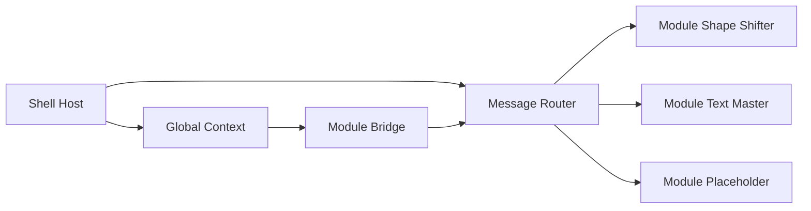

# Tidy-DS-Toolbox Implementation Blueprint

This plan synthesizes the architectural intent described in [`IDEA.md`](IDEA.md) with the actionable scaffolding from [`PLAN.md`](PLAN.md) to deliver a robust "plugin operating system" for Figma.

---

## 1. Architecture Vision & Guardrails

- Treat the Shell as a persistent host responsible for navigation, lifecycle, and shared services (theme, sizing, storage, telemetry).
- Treat each Module as an independent mini-app composed of a UI surface and a main-thread logic handler; Shell loads/unloads them without deep coupling.
- The communication protocol is the nervous system: strictly typed messages flowing Shell ⇄ Modules through the controller in [`src/code.ts`](src/code.ts).
- Favor additive scalability: every new module should require _zero_ modifications to existing module code, and minimal updates (registry entries) elsewhere.

---

## 2. Project Scaffolding & Tooling

1. **Bootstrap** with Vite React TS template, add `@figma/plugin-typings`, `vite-plugin-singlefile`, ESLint, Prettier.
2. **Directory schema** (already outlined in [`PLAN.md`](PLAN.md)): shell primitives in `components/`, modules isolated under `plugins/`, IPC contracts in `shared/`.
3. **Scripts**: `build:ui`, `build:main`, combined `build`, plus `lint`, `typecheck`, and optional `preview` script that opens a static server for UI-only QA.
4. **TypeScript config**: path aliases (`@shell/*`, `@plugins/*`, `@shared/*`) to keep imports stable as the project scales.

---

## 3. Shell Responsibilities & Implementation Steps

1. Create [`src/App.tsx`](src/App.tsx) as a layout shell with Sidebar + Viewport + Global Header.
2. Add `ShellContext` using React Context + `useReducer` to control active module, window sizing, and host-level settings.
3. Implement reusable building blocks in [`src/components`](src/components): `NavItem`, `Card`, `Panel`, `FormControl`.
4. Establish a `ModuleRegistry` object mapping plugin IDs to UI components, metadata (icon, description), and capability flags (needs selection, needs text edit, etc.).
5. Add persistence for last-opened module via `figma.clientStorage` mirrored through postMessages so the shell restores state on open.

---

## 4. Module Contract & Lifecycle

1. Define a `ModuleManifest` interface inside [`src/shared/types.ts`](src/shared/types.ts) capturing `id`, `label`, `icon`, `ui`, `handler`, `permissionRequirements`, and optional `settingsSchema`.
2. Create `module-loader.ts` helper that, given a manifest, wires the UI component into the Shell viewport and exports the corresponding main-thread handler to [`src/code.ts`](src/code.ts).
3. Require every module to expose:
   - `registerModule(manifest)` from UI bundle (for Shell discovery).
   - `handleModuleMessage(action, payload, figma)` from logic file.
4. Provide development scaffolding for future modules by adding a `plop` or simple CLI template script (optional future enhancement).

---

## 5. Communication Protocol & Routing

1. Expand [`src/shared/types.ts`](src/shared/types.ts) to include:
   - `PluginID` union (`"dashboard" | "shape-shifter" | "text-master" | "color-lab" | string & {}` for forward compatibility).
   - `PluginMessage` with `target`, `action`, `payload`, `requestId` for async responses.
   - `ShellMessage` type for host-originated commands (resize, theme sync, settings updates).
2. Implement `postToFigma` and `postToUI` helpers plus type-safe wrappers per module (e.g., `createShapeRectangles(count: number)`), colocated in `shared/bridge.ts`.
3. Inside [`src/code.ts`](src/code.ts):
   - Register module handlers dynamically from a `handlers` map derived from the registry.
   - Validate incoming messages (ensure target exists, action allowed) before invoking module logic.
   - Emit telemetry/logging hooks for debugging (console tags per target).
4. In the Shell (`figma.ui` side), centralize `window.onmessage` handling within a `useMessageBus` hook that dispatches to module-specific reducers or Shell context actions.

---

## 6. Demo Modules & Placeholders

1. **Shape Shifter** (`[`src/plugins/shape-shifter/ui.tsx`](src/plugins/shape-shifter/ui.tsx) & [`src/plugins/shape-shifter/logic.ts`](src/plugins/shape-shifter/logic.ts))
   - UI: numeric input, validate bounds, show status via Shell notifications.
   - Logic: create rectangles, apply default fills, confirm completion via message bus.
2. **Text Master** (`[`src/plugins/text-master/ui.tsx`](src/plugins/text-master/ui.tsx) & [`src/plugins/text-master/logic.ts`](src/plugins/text-master/logic.ts))
   - UI: presets for short/long text, optional custom textarea.
   - Logic: load fonts, insert text node(s), return selection summary.
3. **Placeholder: Color Lab** (`[`src/plugins/color-lab`](src/plugins/color-lab))
   - Manifest entry only; UI shows "Coming soon" card demonstrating how dormant modules appear.
   - Ensures registry + routing gracefully ignore unimplemented logic.
4. Document swap process so future modules only need to provide their manifest + UI + logic and register themselves.

---

## 7. Build, Bundling, and Manifest Workflow

1. Update [`vite.config.ts`](vite.config.ts) with `viteSingleFile()` plugin, `esnext` target, large `assetsInlineLimit`, and alias config.
2. Ensure `tsconfig.json` outputs ES modules for UI, while a separate `tsc` invocation bundles [`src/code.ts`](src/code.ts) to `dist/code.js`.
3. Author `manifest.json` with `main`, `ui`, `id`, `name`, `editorType`, and permissions (`currentUser`, `activeSelection`).
4. Automate builds with combined script plus optional `build:watch` for rapid iterations (`vite build --watch` + `tsc --watch`).
5. Validate bundle size and single-file constraints using `vite-plugin-singlefile` reports; configure CI (GitHub Actions) to run lint, typecheck, build, and upload artifacts.

---

## 8. Validation, Extensibility, and Risk Mitigation

1. **Smoke Tests:** Manual test matrix covering Shell navigation, module loading/unloading, message routing, and error handling when modules throw.
2. **Type Safety:** Enforce discriminated unions for module actions (e.g., `ShapeShifterAction = "create-rects" | ...`) to catch typos pre-build.
3. **Feature Flags:** Provide `enableExperimentalModules` toggle so unfinished modules stay hidden without code removal.
4. **Resilience:** Add global error boundary in the Shell to catch UI crashes, plus try/catch around main-thread handlers to avoid killing the plugin session.
5. **Documentation:** Keep this blueprint alongside module templates so future contributors follow the same patterns.

---

## 9. Milestone Breakdown

1. **Milestone A – Infrastructure (Shell + Protocol)**
   - Complete scaffolding, Shell UI, communication layer, registry, and placeholder module entries.
2. **Milestone B – Demo Modules**
   - Ship Shape Shifter and Text Master end-to-end with validation loops.
3. **Milestone C – Hardening**
   - Build pipeline, manifest polish, automation, telemetry hooks, error handling, CI integration.

This stored plan is ready for handoff to implementation-focused modes while preserving the architectural intent.

## 10. Future Enhancements

1. **Dynamic Module Loading:** Implement lazy loading for modules to improve initial load times.
2. **Theming Support:** Add a theming system to allow users to customize the appearance of the plugin.
3. **User Preferences:** Introduce a settings panel to allow users to customize their experience, such as default module settings.
4. **Performance Optimization:** Continuously monitor and optimize the performance of the plugin, especially as more modules are added.
5. **Community Contributions:** Establish guidelines for community contributions to encourage external developers to contribute to the plugin's growth.
