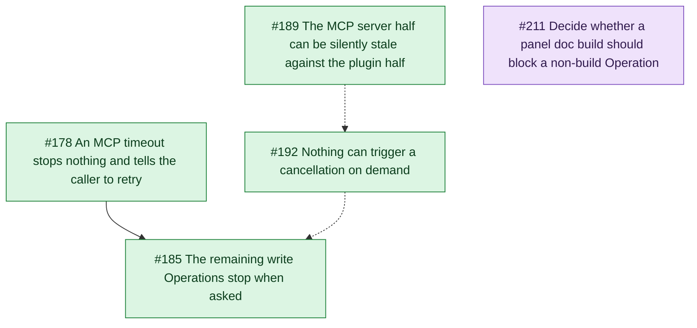
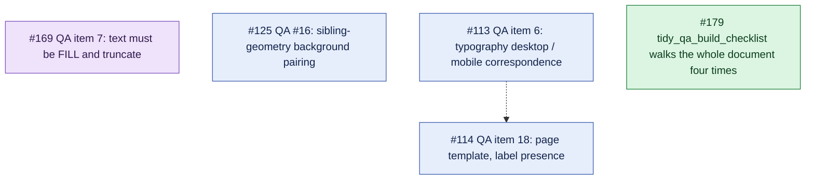
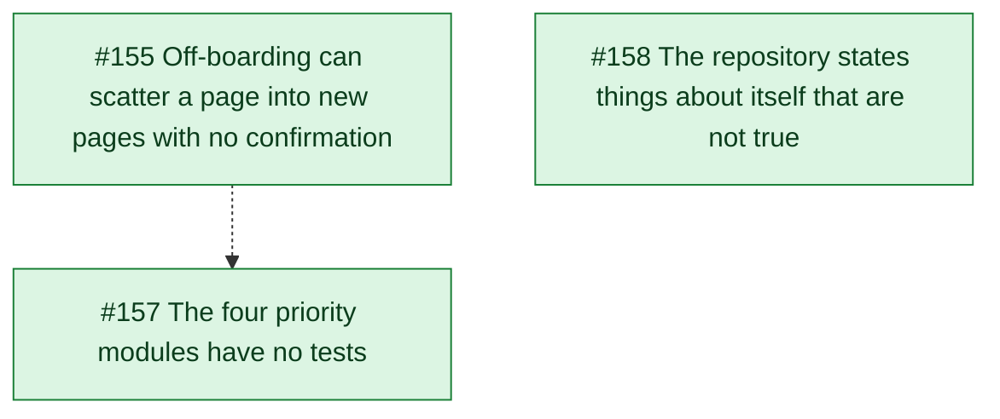
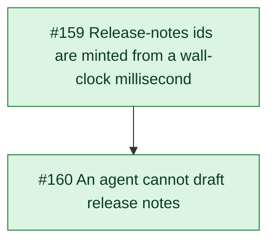
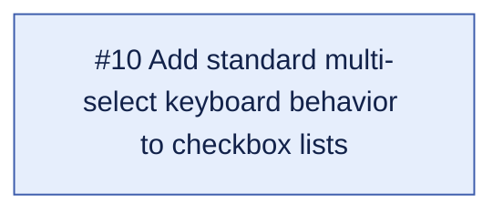

# Open issue map

Generated 2026-08-30.

## Open pull requests

None.

## Thread A - Operations runtime: stopping, staleness, concurrency

This thread is one question asked from four sides: what happens to an Operation that runs too long, and what happens to a second one that arrives while it does.
#178 is the parent, and it is the honesty half - a Bridge timeout stops nothing today and still tells the caller to retry, which for an Execute Operation is advice to run a destructive write twice.
#185 is its declared child and applies the stop pattern that `tidy_ds_template_run` proved to the five remaining write Operations, two of which need more than a token check in a loop.
#192 is the reason to slow #185 down: the stop path has never been observed working against a real file, because the only trigger is an overrun and two attempts to force one produced 116 stray pages and no knowledge.
#189 sits behind that, because the stale-server failure it describes is what blocked the end-to-end verification in the first place, and a stop path verified against a server with no cancel path proves nothing.
#211 belongs to the same runtime but not to the same question: it asks whether a panel doc build and an agent Operation should refuse each other, a pair that today nothing refuses, and it is filed as a product decision rather than a defect because the cheap fix, having a panel build claim the global slot, was tried already and was wrong.

## Thread B - QA engine: checks awaiting a rule, and the cost of a run

Four of these are checks that cannot be built yet, and each names precisely what is missing, which is why they are worth keeping open rather than closing as ideas.
#113 and #114 share one blocker and are joined by it: `ComponentSetSnapshot` deliberately describes exactly one component set, and both need the collector to look outside it - #113 at a mobile counterpart component, #114 at the labels drawn around the set.
#113 is the weaker of the two and says so, filed to record why it is blocked rather than to be picked up, since neither the pairing rule nor the correspondence rule exists anywhere in the source.
#169 is blocked on design rather than architecture: the literal rule cannot fire on the component that prompted it, because no node in `button` is FILL horizontally, so a check gated on FILL would never run.
#125 is blocked on evidence, and needs real files to show how often the ancestor walk is skipping a background that matters before a sibling-geometry model is worth building.
#179 is the odd member and the only ready one: not a check at all, but the cost of a run, four full-document walks asking the same question about a different plugin-data key before anything is drawn.

## Thread C - Audit debts: making the repository honest and testable

All three come out of `docs/audit-2026-08-review.md`, and all three are about the same thing: code and documents that cannot be trusted by the next reader, human or agent.
#155 and #157 give the same diagnosis in the same words - the decision about what to change is mixed into the calls that change it, so there is nothing a test can hold - and #157 names #155 as the worked example its own spec follows, which is why #155 goes first.
#155 is also the more urgent of the pair on its own merits, because Unpack silently treats the page the designer is looking at as the source and takes a working page apart with no dialog before and no summary after.
#158 is the audit turned on the audit: the review read the whole repository, concluded the parked `tags-spacings` folder was deletable, and was wrong, because 274 of its lines are a live dependency of the shipping documentation Operation.
That error is the argument for the ticket, since the false claims sit in the files people and agents read first, and the README carrying one of them is copied into every distributed package.

## Thread D - Release Notes

Two halves of one module, and the order between them is not a preference.
#159 makes the storage safe: ids stop being a wall-clock millisecond, a failed write stops looking like a successful one, and publishing stops leaving the canvas half-empty between the removal and the redraw.
#160 is the automation, and it removes a belief rather than a limitation - the plugin cannot see history, but the REST API can, and the repository already runs that shape of out-of-band script for the approved-asset manifest.
The edge is hard because #159's own argument for urgency is #160: a millisecond collision needs an improbable coincidence by hand and is ordinary under automation, so shipping the automation first knowingly drives the module over ids that overwrite each other, against content that has no export and no backup path.

## Unfiled

#10 is shell interaction polish - shift-click ranges, arrow-key focus, ARIA states on checkbox lists - and it touches none of the four threads above.
It carries the `deferred` label, so it is parked rather than pending, and it is here to stay visible rather than to be picked up.

## Cross-thread relations

- #185 (A) -.-> #179 (B), soft. #185 adds a cancellation checkpoint to `tidy_qa_build_checklist`; #179 replaces the four-walk traversal that checkpoint would sit in, so landing #179 first stops the checkpoint being written twice.
- #157 (C) -.-> Thread B, soft. #157 copies the QA engine's collector-plus-pure-decision split as its model for the four untested modules, so the QA engine is the reference implementation and its shape should not be moving while #157 is being written.
- #160 (D) -.-> #158 (C), soft. #160 adds a second out-of-band REST script beside the asset manifest, and #158 is the ticket that says a documented path must actually exist and be reachable, so the new script should be described under #158's rule rather than adding to the pile it is clearing.
- #211 (A) -.-> #155 (C), soft. Both ask when a write must announce itself before touching the document - #211 between two writers, #155 between the module and the designer - and an answer in one is worth reading before answering the other.

## Stale relations

None.

## Summary table

| Issue | Thread | Type | Blocked by | Blocks |
| --- | --- | --- | --- | --- |
| #178 | A - Operations runtime | PRD | - | #185 |
| #185 | A - Operations runtime | Work | #178, #192 (soft) | - |
| #192 | A - Operations runtime | Work | #189 (soft) | #185 (soft) |
| #189 | A - Operations runtime | Work | - | #192 (soft) |
| #211 | A - Operations runtime | Decision | - | #155 (soft) |
| #179 | B - QA engine | Work | - | #185 (soft) |
| #169 | B - QA engine | Decision | - | - |
| #125 | B - QA engine | Discovery | - | - |
| #114 | B - QA engine | Discovery | #113 (soft) | - |
| #113 | B - QA engine | Record | - | #114 (soft) |
| #155 | C - Audit debts | PRD | - | #157 (soft) |
| #157 | C - Audit debts | PRD | #155 (soft) | - |
| #158 | C - Audit debts | PRD | #160 (soft) | - |
| #159 | D - Release Notes | PRD | - | #160 |
| #160 | D - Release Notes | PRD | #159 | #158 (soft) |
| #10 | Unfiled | Work | - | - |

## Legend - line styles

| Line | Meaning |
| --- | --- |
| `A --> B` | Hard edge. B cannot ship before A. |
| `A -.-> B` | Soft edge. B is better after A, but it can ship without it. |

## Legend - colors

| Color | Meaning |
| --- | --- |
| Green | `ready-for-agent`. Triaged and ready for an implementing agent. |
| Blue | Work. Open, not yet triaged as ready. |
| Purple | Decision. Waits on a person, not on code. |
| Amber | PRD. A specification, not yet a task. |
| Red | Bug. |
