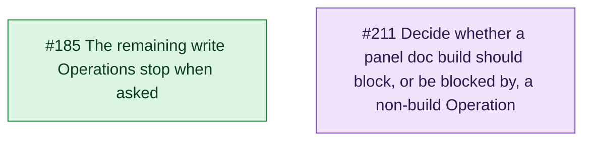
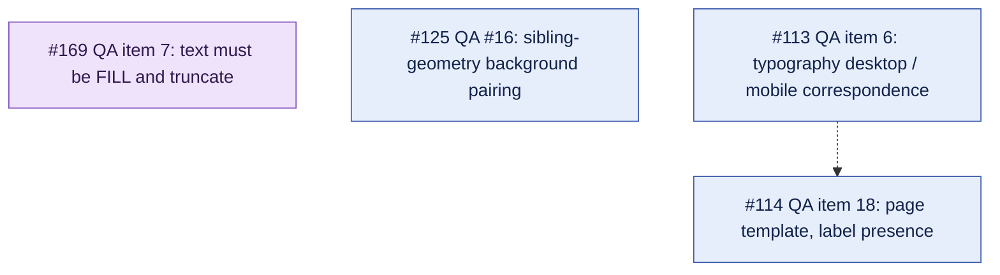
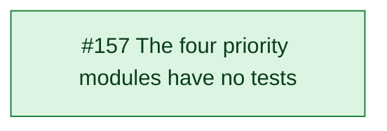
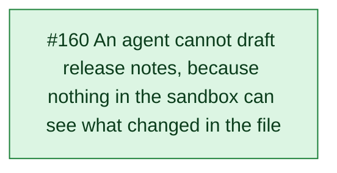
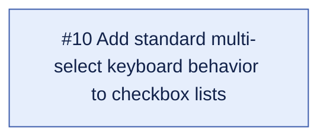

# Open issue map

Generated 2026-08-30.

## Open pull requests

None.

## Thread A - Operations runtime: stopping, staleness, concurrency

This thread asked one question from four sides - what happens to an Operation that runs too long, and what happens to a second one that arrives while it does - and most of it closed on 2026-08-30. #178 is answered: a timeout is worded from the catalogue and tells a write the work continues. #189 is answered: both halves report their versions against each other. #192 is answered: the test-sleep Operations make a cancellation happen on demand, so the stop path is observable instead of relying on macOS throttling an unfocused window.

What remains is the application. #185 carries the stop pattern that `tidy_ds_template_run` proved to the five remaining write Operations, two of which need more than a token check in a loop. It is ready, and for the first time it can be verified end to end, because the trigger #192 built exists.

#211 belongs to the same runtime but not to the same question: it asks whether a panel doc build and an agent Operation should refuse each other, a pair that today nothing refuses. It is filed as a product decision rather than a defect because the cheap fix, having a panel build claim the global slot, was tried already and was wrong; #187 has since removed the second route to the builder, so what is left is a decision about the vestigial lock, not a live hazard.

## Thread B - QA engine: checks awaiting a rule, and the cost of a run

#179 closed on 2026-08-30: the run's cost question is answered, and one traversal now feeds the checklist lookup and every removal.

Three of the remaining four are checks that cannot be built yet, and each names precisely what is missing, which is why they are worth keeping open rather than closing as ideas.
#113 and #114 share one blocker and are joined by it: `ComponentSetSnapshot` deliberately describes exactly one component set, and both need the collector to look outside it - #113 at a mobile counterpart component, #114 at the labels drawn around the set.
#113 is the weaker of the two and says so, filed to record why it is blocked rather than to be picked up, since neither the pairing rule nor the correspondence rule exists anywhere in the source.
#169 is blocked on design rather than architecture: the literal rule cannot fire on the component that prompted it, because no node in `button` is FILL horizontally, so a check gated on FILL would never run.
#125 is blocked on evidence, and needs real files to show how often the ancestor walk is skipping a background that matters before a sibling-geometry model is worth building.

## Thread C - Audit debts: making the repository honest and testable

The thread's other two members closed on 2026-08-30. #158 is done: the README and CLAUDE.md are held to the manifest by a committed test, and the lint ceiling the audit inherited is down to 147. #155 is done: Off-Boarding decides before it writes, shows a plan, asks, and applies it, with the temporary page identified by a marker and Unpack refused rather than guessed.

#157 is what the other two existed to prepare. Its own diagnosis - the decision about what to change is mixed into the calls that change it, so there is nothing a test can hold - is the same one #155 answered for one module, and #155 is the worked example its spec follows. With the example shipped and the repository's statements about itself true, the four priority modules are the remaining debt, and the collector-plus-pure-decision split it copies is now in the codebase to copy from.

## Thread D - Release Notes

#159 closed on 2026-08-30: ids are minted with a collision guarantee, a failed write reports itself, and a publish draws before it sweeps. The storage half of the module is safe, and the hard edge that ordered the two halves is satisfied.

#160 is the automation half, and it removes a belief rather than a limitation - the plugin cannot see history, but the REST API can, and the repository already runs that shape of out-of-band script for the approved-asset manifest.

## Unfiled

#10 is shell interaction polish - shift-click ranges, arrow-key focus, ARIA states on checkbox lists - and it touches none of the threads above.
It carries the `deferred` label, so it is parked rather than pending, and it is here to stay visible rather than to be picked up.

## Cross-thread relations

- #157 (C) -.-> Thread B, soft. #157 copies the QA engine's collector-plus-pure-decision split as its model for the four untested modules, so the QA engine is the reference implementation and its shape should not be moving while #157 is being written.

## Stale relations

Edges whose issues have closed. Kept so the reasons survive the nodes.

- #178 --> #185 (was Thread A, hard). #178 was the parent and #185 its declared child: the stop pattern #178 introduced is what #185 applies. #178 closed 2026-08-30.
- #192 -.-> #185 (was Thread A, soft). The stop path had never been observed working; #192 shipped the test-sleep Operations that made a cancellation possible on demand. Closed 2026-08-30.
- #189 -.-> #192 (was Thread A, soft). The stale-server failure #189 described was what blocked end-to-end verification of the stop path. Closed 2026-08-30.
- #155 -.-> #157 (was Thread C, soft). #157 named #155 as the worked example its own spec follows. #155 closed 2026-08-30; #157 stays open and the example it was to follow is now in the codebase.
- #159 --> #160 (was Thread D, hard). Shipping the automation first would have driven it over ids that overwrite each other, against content with no backup. #159 closed 2026-08-30.
- #185 (A) -.-> #179 (B), was cross-thread, soft. #185 adds a cancellation checkpoint to `tidy_qa_build_checklist`; #179 replaced the four-walk traversal that checkpoint would sit in, so landing #179 first stopped the checkpoint being written twice. Both closed 2026-08-30.
- #160 (D) -.-> #158 (C), was cross-thread, soft. #160 adds a second out-of-band REST script beside the asset manifest, and #158 is the rule that a documented path must actually exist and be reachable. #158 closed 2026-08-30.
- #211 (A) -.-> #155 (C), was cross-thread, soft. Both ask when a write must announce itself before touching the document - #211 between two writers, #155 between the module and the designer. #155 closed 2026-08-30.

## Summary table

| Issue | Thread | Type | Blocked by | Blocks |
| --- | --- | --- | --- | --- |
| #185 | A - Operations runtime | Work | - | - |
| #211 | A - Operations runtime | Decision | - | - |
| #157 | C - Audit debts | PRD | - | - |
| #169 | B - QA engine | Decision | - | - |
| #125 | B - QA engine | Discovery | - | - |
| #114 | B - QA engine | Discovery | #113 (soft) | - |
| #113 | B - QA engine | Record | - | #114 (soft) |
| #160 | D - Release Notes | PRD | - | - |
| #10 | Unfiled | Work | - | - |

## Legend - line styles

| Line | Meaning |
| --- | --- |
| `A --> B` | Hard edge. B cannot ship before A. |
| `A -.-> B` | Soft edge. B is better after A, but it can ship without it. |

## Legend - colors

| Color | Meaning |
| --- | --- |
| Green | `ready-for-agent`. Triaged and ready for an implementing agent. |
| Blue | Work. Open, not yet triaged as ready. |
| Purple | Decision. Waits on a person, not on code. |
| Amber | PRD. A specification, not yet a task. |
| Red | Bug. |
